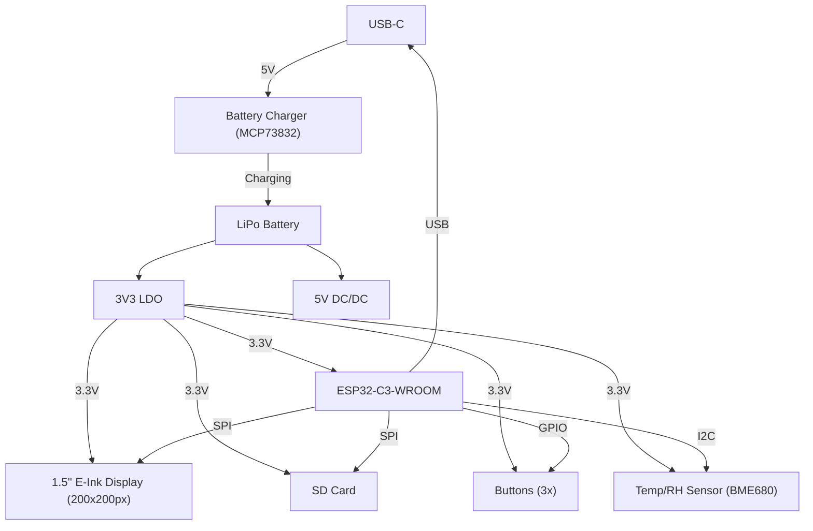

# E-Book_ReaderTSC

## 📘 Schema bloc

# List of Components

Aici sunt listate componentele, impreuna cu linkurile pentru a verifica preturile si fisele tehnice. Unele componente nu au un model specificat, si în acele cazuri, fisele tehnice si linkurile catre preturi sunt marcate ca `#N/A`.
+ also SJ-ul si TP-urile sunt modelate de mine, deci nu am importat model 3D.

| Name of component  | Device                                    | Check Prices                                                                 | DataSheet                                                                  |
|--------------------|-------------------------------------------|-----------------------------------------------------------------------------|----------------------------------------------------------------------------|
| BOOT_BUTTON        | BUTTON_CUSYOMV1                           | [Check Price](https://industry.panasonic.com/global/en/products/control/switch/light-touch/number/evqpuj02k)  | [DataSheet](https://industry.panasonic.com/global/en/products/control/switch/light-touch/number/evqpuj02k) |
| C1                 | ESP32_WROVER_EAGLE-LTSPICE_CC0402         | [Check Price](https://industry.panasonic.com/global/en/products/control/switch/light-touch/number/evqpuj02k)  | [DataSheet](https://industry.panasonic.com/global/en/products/control/switch/light-touch/number/evqpuj02k) |
| C1_BAT             | ESP32_WROVER_EAGLE-LTSPICE_CC0402         | #N/A                                                                         | #N/A                                                                      |
| C1_BAT1            | EAGLE-LTSPICE_CC0402                      | #N/A                                                                         | #N/A                                                                      |
| C1_BAT2            | EAGLE-LTSPICE_CC0402                      | #N/A                                                                         | #N/A                                                                      |
| C2                 | ESP32_WROVER_EAGLE-LTSPICE_CC0402         | #N/A                                                                         | #N/A                                                                      |
| C2_BAT\            | ESP32_WROVER_EAGLE-LTSPICE_CC0402         | #N/A                                                                         | #N/A                                                                      |
| C3                 | RCL_CPOL-EUCT3528                         | #N/A                                                                         | #N/A                                                                      |
| C4                 | ESP32_WROVER_EAGLE-LTSPICE_CC0402         | #N/A                                                                         | #N/A                                                                      |
| C4_USB             | ESP32_WROVER_EAGLE-LTSPICE_CC0402         | #N/A                                                                         | #N/A                                                                      |
| C5                 | ESP32_WROVER_EAGLE-LTSPICE_CC0402         | #N/A                                                                         | #N/A                                                                      |
| C5_USB             | ESP32_WROVER_EAGLE-LTSPICE_CC0402         | #N/A                                                                         | #N/A                                                                      |
| C6                 | ESP32_WROVER_EAGLE-LTSPICE_CC0402         | #N/A                                                                         | #N/A                                                                      |
| C7                 | ESP32_WROVER_EAGLE-LTSPICE_CC0402         | #N/A                                                                         | #N/A                                                                      |
| C8                 | ESP32_WROVER_EAGLE-LTSPICE_CC0402         | #N/A                                                                         | #N/A                                                                      |
| C9                 | EAGLE-LTSPICE_CC0402                      | #N/A                                                                         | #N/A                                                                      |
| C10                | ESP32_WROVER_EAGLE-LTSPICE_CC0402         | #N/A                                                                         | #N/A                                                                      |
| C10_SUPERCAP       | CPH3225A                                  | [Check Price](https://www.snapeda.com/parts/CPH3225A/Seiko+Instruments/view-part/?ref=eda) | [DataSheet](https://www.snapeda.com/parts/CPH3225A/Seiko+Instruments/view-part/?ref=eda) |
| CHANGE_BUTTON      | BUTTON_CUSYOMV1                           | [Check Price](https://industry.panasonic.com/global/en/products/control/switch-light-touch/number/evqpuj02k)  | [DataSheet](https://industry.panasonic.com/global/en/products/control/switch-light-touch/number/evqpuj02k) |
| CHG_LED            | ADAFRUIT_LEDCHIP-LED0603                  | [Check Price](https://www.snapeda.com/parts/KP-1608SURCK/Kingbright/view-part/?ref=search&t=LED%200603) | [DataSheet](https://www.snapeda.com/parts/KP-1608SURCK/Kingbright/view-part/?ref=search&t=LED%200603) |
| C_DELAY            | ESP32_WROVER_EAGLE-LTSPICE_CC0402         | #N/A                                                                         | #N/A                                                                      |
| D1                 | USBLC6-2SC6Y                              | [Check Price](https://www.snapeda.com/parts/USBLC6-2SC6Y/STMicroelectronics/view-part/?ref=eda) | [DataSheet](https://www.snapeda.com/parts/USBLC6-2SC6Y/STMicroelectronics/view-part/?ref=eda) |
| D2                 | ESP32_WROVER_AVX---SD0805S020S1R0_AVX_... | [Check Price](https://eu.mouser.com/ProductDetail/KYOCERA-AVX/SD0805S020S1R0?qs=jCA%252BPfw4LHbpkAoSnwrdjw%3D%3D) | [DataSheet](http://datasheets.avx.com/schottky.pdf)                       |
| D3                 | MBR0530                                   | [Check Price](https://eu.mouser.com/ProductDetail/KYOCERA-AVX/SD0805S020S1R0?qs=jCA%252BPfw4LHbpkAoSnwrdjw%3D%3D) | [DataSheet](https://eu.mouser.com/ProductDetail/KYOCERA-AVX/SD0805S020S1R0?qs=jCA%252BPfw4LHbpkAoSnwrdjw%3D%3D) |
| D4                 | MBR0530                                   | [Check Price](https://www.snapeda.com/parts/MBR0530/Onsemi/view-part/?ref=eda) | [DataSheet](https://www.snapeda.com/parts/MBR0530/Onsemi/view-part/?ref=eda) |
| D5                 | MBR0530                                   | [Check Price](https://www.snapeda.com/parts/MBR0530/Onsemi/view-part/?ref=eda) | [DataSheet](https://www.snapeda.com/parts/MBR0530/Onsemi/view-part/?ref=eda) |
| D6                 | PGB1010603MR                              | [Check Price](https://www.snapeda.com/parts/PGB1010603MR/Littelfuse/view-part/?ref=eda) | [DataSheet](https://www.snapeda.com/parts/PGB1010603MR/Littelfuse/view-part/?ref=eda) |
| D7                 | ESP32_WROVER_AVX---SD0805S020S1R0_AVX_... | [Check Price](https://eu.mouser.com/ProductDetail/KYOCERA-AVX/SD0805S020S1R0?qs=jCA%252BPfw4LHbpkAoSnwrdjw%3D%3D) | [DataSheet](http://datasheets.avx.com/schottky.pdf)                       |
| D8                 | PGB1010603MR                              | [Check Price](https://www.snapeda.com/parts/PGB1010603MR/Littelfuse/view-part/?ref=eda) | [DataSheet](https://www.snapeda.com/parts/PGB1010603MR/Littelfuse/view-part/?ref=eda) |
| D9                 | PGB1010603MR                              | [Check Price](https://www.snapeda.com/parts/PGB1010603MR/Littelfuse/view-part/?ref=eda) | [DataSheet](https://www.snapeda.com/parts/PGB1010603MR/Littelfuse/view-part/?ref=eda) |
| D10                | PGB1010603MR                              | [Check Price](https://www.snapeda.com/parts/PGB1010603MR/Littelfuse/view-part/?ref=eda) | [DataSheet](https://www.snapeda.com/parts/PGB1010603MR/Littelfuse/view-part/?ref=eda) |
| D11                | PGB1010603MR                              | [Check Price](https://www.snapeda.com/parts/PGB1010603MR/Littelfuse/view-part/?ref=eda) | [DataSheet](https://www.snapeda.com/parts/PGB1010603MR/Littelfuse/view-part/?ref=eda) |
| D12                | PGB1010603MR                              | [Check Price](https://www.snapeda.com/parts/PGB1010603MR/Littelfuse/view-part/?ref=eda) | [DataSheet](https://www.snapeda.com/parts/PGB1010603MR/Littelfuse/view-part/?ref=eda) |
| EPD_C1             | ESP32_WROVER_EAGLE-LTSPICE_CC0402         | #N/A                                                                         | #N/A                                                                      |
| EPD_C2             | ESP32_WROVER_EAGLE-LTSPICE_CC0402         | #N/A                                                                         | #N/A                                                                      |
| EPD_C5             | ESP32_WROVER_EAGLE-LTSPICE_CC0402         | #N/A                                                                         | #N/A                                                                      |
| EPD_C6             | ESP32_WROVER_EAGLE-LTSPICE_CC0402         | #N/A                                                                         | #N/A                                                                      |
| EPD_C7             | ESP32_WROVER_EAGLE-LTSPICE_CC0402         | #N/A                                                                         | #N/A                                                                      |
| EPD_C8             | ESP32_WROVER_EAGLE-LTSPICE_CC0402         | #N/A                                                                         | #N/A                                                                      |
| EPD_C9             | ESP32_WROVER_EAGLE-LTSPICE_CC0402         | #N/A                                                                         | #N/A                                                                      |
| EPD_C10            | ESP32_WROVER_EAGLE-LTSPICE_CC0402         | #N/A                                                                         | #N/A                                                                      |
| EPD_C11            | ESP32_WROVER_EAGLE-LTSPICE_CC0402         | #N/A                                                                         | #N/A                                                                      |
| EPD_C12            | ESP32_WROVER_EAGLE-LTSPICE_CC0402         | #N/A                                                                         | #N/A                                                                      |
| IC1                | BD5229G-TR                                | [Check Price](https://componentsearchengine.com/part-view/BD5229G-TR/ROHM%20Semiconductor) | [DataSheet](https://componentsearchengine.com/part-view/BD5229G-TR/ROHM%20Semiconductor) |
| IC4                | XC6220A331MR-G                            | [Check Price](https://componentsearchengine.com/part-view/XC6220A331MR-G/Torex) | [DataSheet](https://componentsearchengine.com/part-view/XC6220A331MR-G/Torex) |
| J1                 | FH34SRJ-24S-0.5SH_99_                     | [Check Price](https://componentsearchengine.com/part-view/XC6220A331MR-G/Torex) | [DataSheet](https://componentsearchengine.com/part-view/XC6220A331MR-G/Torex) |
| J2                 | SAMACSYS_PARTS_USB4110-GF-A               | [Check Price](https://componentsearchengine.com/part-view/USB4110-GF-A/GCT%20(GLOBAL%20CONNECTOR%20TECHNOLOGY) | [DataSheet](https://componentsearchengine.com/part-view/USB4110-GF-A/GCT%20(GLOBAL%20CONNECTOR%20TECHNOLOGY) |
| J3                 | QWIIC_CONNECTORJS-1MM                     | #N/A                                                                         | #N/A                                                                      |
| J4                 | 112A-TAAR-R03_ATTEND                      | [Check Price](https://store.comet.srl.ro/Catalogue/Product/43497/)           | [DataSheet](https://store.comet.srl.ro/Catalogue/Product/43497/)          |
| L1                 | 744043680IND_4828-WE-TPC_WRE              | [Check Price](https://eu.mouser.com/ProductDetail/Wurth-Elektronik/744043680?qs=PGXP4M47uW6VkZq%252BkzjrHA%3D%3D) | [DataSheet](https://eu.mouser.com/ProductDetail/Wurth-Elektronik/744043680?qs=PGXP4M47uW6VkZq%252BkzjrHA%3D%3D) |
| PFMF.050.1         | ESP32C6_VARISTORCN1812                    | [Check Price](https://www.mouser.co.uk/ProductDetail/EPCOS-TDK/B72520T0350K062?qs=dEfas%2FXlABIszF52uu7vrg%3D%3D) | [DataSheet](https://www.mouser.co.uk/ProductDetail/EPCOS-TDK/B72520T0350K062?qs=dEfas%2FXlABIszF52uu7vrg%3D%3D) |
| Q1                 | ESP32_WROVER_SPARKFUN-DISCRETESEMI_MOSFET_... | [Check Price](https://componentsearchengine.com/part-view/DMG2305UX-7/Diodes%20Incorporated) | [DataSheet](https://componentsearchengine.com/part-view/DMG2305UX-7/Diodes%20Incorporated) |
| Q2                 | ESP32_WROVER_SPARKFUN-DISCRETESEMI_MOSFET_... | #N/A                                                                         | #N/A                                                                      |
| Q3                 | D8                                        | [Check Price](https://componentsearchengine.com/part-view/PGB1010603MR/Littelfuse) | [DataSheet](https://componentsearchengine.com/part-view/PGB1010603MR/Littelfuse) |
| Q4                 | Q2_TS-B2_REACHPACK                        | #N/A                                                                         | #N/A                                                                      |

## 3. Detalii despre functionalitatea hardware

### Microcontroller – ESP32-C3-WROOM
Microcontroller-ul utilizat este ESP32-C3-WROOM, un procesor 32-bit RISC-V, care ruleaza la frecvente de pana la 160MHz. Acesta dispune de 512KB de SRAM intern si 8MB de flash extern, suficiente pentru a sustine aplicatii complexe. ESP32-C3-WROOM beneficiaza de conectivitate Wi-Fi 6 si Bluetooth 5, facilitand conexiuni rapide si stabile. Printre perifericele sale se numara SPI, I²C, UART si GPIO multiple, iar pentru economisirea energiei, dispune de moduri de tip sleep si deep sleep.

### Ecran E-Paper (1.5 inch)
Ecranul e-paper utilizat are o rezolutie de 200x200px si comunica cu ESP32 prin interfata SPI cu 4 pini (CS, DC, RST, BUSY). Desi consumul de energie este foarte redus in timpul afisarii statice, la fiecare refresh al imaginii ecranul necesita aproximativ 15–25mA, in functie de modul de actualizare ales. Acest tip de afisaj este ideal pentru aplicatiile de tip e-reader, datorita consumului minim de energie in mod static.

### Senzor de mediu – BME680
Senzorul BME680 masoara temperatura, umiditatea, presiunea si calitatea aerului (VOC/eCO2). Acesta comunica cu microcontroller-ul prin I²C la 400kHz, iar consumul in modul standby este de doar 2.1µA, crescand pana la cativa mA in timpul masurarilor. BME680 este o alegere excelenta datorita capacitatii sale de a integra multiple tipuri de masuratori intr-un singur cip, oferind date importante pentru monitorizarea mediului.

### Gestionarea energiei – Baterie Li-Po si IC de incarcare
Dispozitivul este alimentat de o baterie Li-Po de 2500mAh, care ofera o autonomie extinsa. IC-ul de incarcare MCP73832, compatibil cu incarcarea prin USB-C, permite incarcarea bateriei cu un curent de pana la 1A. Monitorizarea nivelului bateriei se face prin intermediul unui fuel gauge MAX17048, care transmite informatii despre tensiune si stare prin I²C. Pentru a asigura o tensiune stabila de 3.3V, se foloseste un regulator LDO XC6220A331MR-G, care alimenteaza microcontroller-ul si celelalte componente.

### Butoane tactile pentru interactiune
Dispozitivul dispune de trei butoane tactile pentru navigarea prin meniu, selectarea optiunilor si schimbarea paginilor. Fiecare buton este conectat la un GPIO al microcontroller-ului printr-un circuit de debouncing, care asigura o interactiune fiabila. Debouncing-ul poate fi implementat fie hardware, printr-o combinatie de rezistor si condensator, fie in firmware.

### Port USB-C
Portul USB-C permite atat incarcarea bateriei, cat si transferul de date. Acesta poate fi utilizat si pentru actualizari de firmware prin bootloader sau OTA prin Wi-Fi. Protectiile incluse (ESD si rezistente de terminare) asigura o protectie suplimentara impotriva eventualelor probleme de conectivitate.

### Conector Qwiic (I²C)
Conectorul Qwiic standardizat, cu patru pini (VCC, GND, SDA, SCL), faciliteaza integrarea rapida a modulelor I²C externe. Acesta este ideal pentru extinderea dispozitivului cu senzori suplimentari sau pentru prototipuri rapide.

### Card SD pentru stocare externa
Dispozitivul include un conector pentru card SD, permitand stocarea de e-book-uri, loguri sau fisiere pentru actualizari de firmware. Interfata poate fi configurata in modul SD (1-bit/4-bit) sau SPI, in functie de necesitatile firmware-ului.

### RTC DS3231
RTC-ul DS3231 asigura un ceas de timp real precis si mentine timpul chiar si atunci cand dispozitivul nu este alimentat, datorita unei baterii secundare sau supercondensatorului de backup. Comunicarea cu microcontroller-ul se face prin I²C.

### Memorie externa Flash (W25Q512JVEIQ)
Memoria flash externa W25Q512JVEIQ, conectata prin SPI dedicat (quad SPI), este utilizata pentru stocarea firmware-ului si a fisierelor mari (e-book-uri, etc.). Acesta permite o incarcare rapida a datelor si o capacitate mare de stocare.

### Comunicare si interfete
Dispozitivul utilizeaza diverse interfete pentru a comunica cu componentele sale:

- **SPI**: Ecranul e-paper si memoria flash externa utilizeaza SPI pentru comunicare.
- **I²C**: Senzorul BME680, fuel gauge MAX17048, RTC DS3231 si conectorul Qwiic sunt conectate prin I²C.
- **USB-C**: Transfer de date si alimentare.
- **GPIO**: Butoane tactile si semnale de control pentru display.

### Estimarea consumului de energie
- **ESP32-C3-WROOM** (activ): ~80mA (Wi-Fi activ) / < 10mA (idle)
- **E-Paper (refresh)**: ~15–25mA (doar in timpul refresh-ului)
- **BME680** (activ): ~3.6mA (peak) / 2.1µA (sleep)
- **MAX17048 (fuel gauge)**: ~50µA
- **DS3231 (RTC)**: ~3.5mA (activ) / <1µA (back-up)
- **MCP73832 (charger)**: Depinde de curentul de incarcare

In modul Deep Sleep, consumul total scade sub 50-100µA, iar in utilizare activa cu Wi-Fi si actualizari frecvente ale ecranului, consumul poate ajunge la 100-150mA.

Cu o baterie de 2500mAh, dispozitivul poate avea o autonomie de cateva saptamani in regim normal de utilizare, in care majoritatea timpului este in stare inactiva si doar afiseaza imagini statice.

## 4. Detalierea pinilor ESP32-C6 utilizati pentru fiecare componenta

| Pin ESP32-C6  | Componenta / Semnal                       | Explicatie                                           |
|---------------|-------------------------------------------|------------------------------------------------------|
| GPIO1         | I²C SDA (BME688, MAX17048, DS3231, Qwiic) | Se foloseste pentru a partaja magistrala I²C intre toti senzorii si RTC. |
| GPIO2         | I²C SCL (BME688, MAX17048, DS3231, Qwiic) | Linia de clock pentru comunicarea I²C.              |
| GPIO5         | SPI MISO (E-Paper)                       | Pinul pentru citirea datelor sau a statusului de la ecranul e-paper. |
| GPIO6         | SPI MOSI (E-Paper)                       | Trimiterea datelor catre ecranul e-paper.            |
| GPIO7         | SPI CLK (E-Paper)                        | Semnal de clock pentru sincronizarea cu e-paper.    |
| GPIO8         | SPI CS (E-Paper)                         | Chip Select pentru a activa comunicarea cu e-paper.  |
| GPIO9         | E-Paper DC (Data/Command)                | Semnal pentru a diferentia intre date si comenzi pentru ecranul e-paper. |
| GPIO10        | E-Paper RST                              | Pinul de reset hardware pentru e-paper.              |
| GPIO11        | E-Paper BUSY                             | Intrare din display care indica daca ecranul este ocupat sau nu. |
| GPIO12        | Button #1                                | Intrare digitala pentru primul buton (ex. pagina urmatoare). |
| GPIO13        | Button #2                                | Intrare digitala pentru al doilea buton (ex. pagina anterioara). |
| GPIO14        | Button #3                                | Intrare digitala pentru al treilea buton (ex. Meniu/OK). |
| GPIO15        | MAX17048 ALERT (optional)                | Semnal de alerta de la MAX17048 pentru nivel scazut al bateriei. |
| GPIO16        | USB D+ (intern la USB PHY)               | Pin dedicat pentru semnalul USB 2.0 (D+).            |
| GPIO17        | USB D- (intern la USB PHY)               | Pin dedicat pentru semnalul USB 2.0 (D-).            |
| GPIO18        | LED de status (optional)                 | Indicator pentru diverse stari (ex. Wi-Fi, incarcare, etc.). |
| GPIO19        | SD Card CS (optional)                    | Chip Select pentru cardul SD (daca se foloseste SPI). |
| GPIO20        | SD Card MISO (optional)                  | Intrare date de la cardul SD.                        |
| GPIO21        | SD Card MOSI (optional)                  | Iesire date catre cardul SD.                         |
| GPIO4         | SD Card CLK (optional)                   | Semnal de clock pentru cardul SD (SPI).              |

