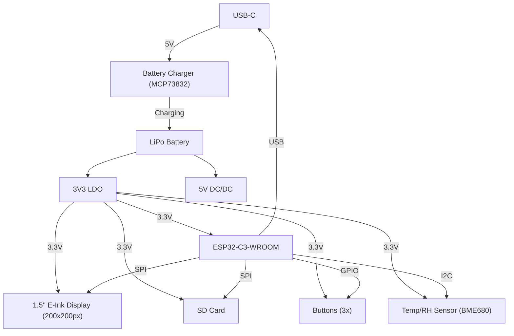

# E-Book_ReaderTSC

## 📘 Schema bloc

# List of Components

Aici sunt listate componentele, impreuna cu linkurile pentru a verifica preturile si fisele tehnice. Unele componente nu au un model specificat, si în acele cazuri, fisele tehnice si linkurile catre preturi sunt marcate ca `#N/A`.

| Name of component  | Device                                    | Check Prices                                                                 | DataSheet                                                                  |
|--------------------|-------------------------------------------|-----------------------------------------------------------------------------|----------------------------------------------------------------------------|
| BOOT_BUTTON        | BUTTON_CUSYOMV1                           | [Check Price](https://industry.panasonic.com/global/en/products/control/switch/light-touch/number/evqpuj02k)  | [DataSheet](https://industry.panasonic.com/global/en/products/control/switch/light-touch/number/evqpuj02k) |
| C1                 | ESP32_WROVER_EAGLE-LTSPICE_CC0402         | [Check Price](https://industry.panasonic.com/global/en/products/control/switch/light-touch/number/evqpuj02k)  | [DataSheet](https://industry.panasonic.com/global/en/products/control/switch/light-touch/number/evqpuj02k) |
| C1_BAT             | ESP32_WROVER_EAGLE-LTSPICE_CC0402         | #N/A                                                                         | #N/A                                                                      |
| C1_BAT1            | EAGLE-LTSPICE_CC0402                      | #N/A                                                                         | #N/A                                                                      |
| C1_BAT2            | EAGLE-LTSPICE_CC0402                      | #N/A                                                                         | #N/A                                                                      |
| C2                 | ESP32_WROVER_EAGLE-LTSPICE_CC0402         | #N/A                                                                         | #N/A                                                                      |
| C2_BAT\            | ESP32_WROVER_EAGLE-LTSPICE_CC0402         | #N/A                                                                         | #N/A                                                                      |
| C3                 | RCL_CPOL-EUCT3528                         | #N/A                                                                         | #N/A                                                                      |
| C4                 | ESP32_WROVER_EAGLE-LTSPICE_CC0402         | #N/A                                                                         | #N/A                                                                      |
| C4_USB             | ESP32_WROVER_EAGLE-LTSPICE_CC0402         | #N/A                                                                         | #N/A                                                                      |
| C5                 | ESP32_WROVER_EAGLE-LTSPICE_CC0402         | #N/A                                                                         | #N/A                                                                      |
| C5_USB             | ESP32_WROVER_EAGLE-LTSPICE_CC0402         | #N/A                                                                         | #N/A                                                                      |
| C6                 | ESP32_WROVER_EAGLE-LTSPICE_CC0402         | #N/A                                                                         | #N/A                                                                      |
| C7                 | ESP32_WROVER_EAGLE-LTSPICE_CC0402         | #N/A                                                                         | #N/A                                                                      |
| C8                 | ESP32_WROVER_EAGLE-LTSPICE_CC0402         | #N/A                                                                         | #N/A                                                                      |
| C9                 | EAGLE-LTSPICE_CC0402                      | #N/A                                                                         | #N/A                                                                      |
| C10                | ESP32_WROVER_EAGLE-LTSPICE_CC0402         | #N/A                                                                         | #N/A                                                                      |
| C10_SUPERCAP       | CPH3225A                                  | [Check Price](https://www.snapeda.com/parts/CPH3225A/Seiko+Instruments/view-part/?ref=eda) | [DataSheet](https://www.snapeda.com/parts/CPH3225A/Seiko+Instruments/view-part/?ref=eda) |
| CHANGE_BUTTON      | BUTTON_CUSYOMV1                           | [Check Price](https://industry.panasonic.com/global/en/products/control/switch-light-touch/number/evqpuj02k)  | [DataSheet](https://industry.panasonic.com/global/en/products/control/switch-light-touch/number/evqpuj02k) |
| CHG_LED            | ADAFRUIT_LEDCHIP-LED0603                  | [Check Price](https://www.snapeda.com/parts/KP-1608SURCK/Kingbright/view-part/?ref=search&t=LED%200603) | [DataSheet](https://www.snapeda.com/parts/KP-1608SURCK/Kingbright/view-part/?ref=search&t=LED%200603) |
| C_DELAY            | ESP32_WROVER_EAGLE-LTSPICE_CC0402         | #N/A                                                                         | #N/A                                                                      |
| D1                 | USBLC6-2SC6Y                              | [Check Price](https://www.snapeda.com/parts/USBLC6-2SC6Y/STMicroelectronics/view-part/?ref=eda) | [DataSheet](https://www.snapeda.com/parts/USBLC6-2SC6Y/STMicroelectronics/view-part/?ref=eda) |
| D2                 | ESP32_WROVER_AVX---SD0805S020S1R0_AVX_... | [Check Price](https://eu.mouser.com/ProductDetail/KYOCERA-AVX/SD0805S020S1R0?qs=jCA%252BPfw4LHbpkAoSnwrdjw%3D%3D) | [DataSheet](http://datasheets.avx.com/schottky.pdf)                       |
| D3                 | MBR0530                                   | [Check Price](https://eu.mouser.com/ProductDetail/KYOCERA-AVX/SD0805S020S1R0?qs=jCA%252BPfw4LHbpkAoSnwrdjw%3D%3D) | [DataSheet](https://eu.mouser.com/ProductDetail/KYOCERA-AVX/SD0805S020S1R0?qs=jCA%252BPfw4LHbpkAoSnwrdjw%3D%3D) |
| D4                 | MBR0530                                   | [Check Price](https://www.snapeda.com/parts/MBR0530/Onsemi/view-part/?ref=eda) | [DataSheet](https://www.snapeda.com/parts/MBR0530/Onsemi/view-part/?ref=eda) |
| D5                 | MBR0530                                   | [Check Price](https://www.snapeda.com/parts/MBR0530/Onsemi/view-part/?ref=eda) | [DataSheet](https://www.snapeda.com/parts/MBR0530/Onsemi/view-part/?ref=eda) |
| D6                 | PGB1010603MR                              | [Check Price](https://www.snapeda.com/parts/PGB1010603MR/Littelfuse/view-part/?ref=eda) | [DataSheet](https://www.snapeda.com/parts/PGB1010603MR/Littelfuse/view-part/?ref=eda) |
| D7                 | ESP32_WROVER_AVX---SD0805S020S1R0_AVX_... | [Check Price](https://eu.mouser.com/ProductDetail/KYOCERA-AVX/SD0805S020S1R0?qs=jCA%252BPfw4LHbpkAoSnwrdjw%3D%3D) | [DataSheet](http://datasheets.avx.com/schottky.pdf)                       |
| D8                 | PGB1010603MR                              | [Check Price](https://www.snapeda.com/parts/PGB1010603MR/Littelfuse/view-part/?ref=eda) | [DataSheet](https://www.snapeda.com/parts/PGB1010603MR/Littelfuse/view-part/?ref=eda) |
| D9                 | PGB1010603MR                              | [Check Price](https://www.snapeda.com/parts/PGB1010603MR/Littelfuse/view-part/?ref=eda) | [DataSheet](https://www.snapeda.com/parts/PGB1010603MR/Littelfuse/view-part/?ref=eda) |
| D10                | PGB1010603MR                              | [Check Price](https://www.snapeda.com/parts/PGB1010603MR/Littelfuse/view-part/?ref=eda) | [DataSheet](https://www.snapeda.com/parts/PGB1010603MR/Littelfuse/view-part/?ref=eda) |
| D11                | PGB1010603MR                              | [Check Price](https://www.snapeda.com/parts/PGB1010603MR/Littelfuse/view-part/?ref=eda) | [DataSheet](https://www.snapeda.com/parts/PGB1010603MR/Littelfuse/view-part/?ref=eda) |
| D12                | PGB1010603MR                              | [Check Price](https://www.snapeda.com/parts/PGB1010603MR/Littelfuse/view-part/?ref=eda) | [DataSheet](https://www.snapeda.com/parts/PGB1010603MR/Littelfuse/view-part/?ref=eda) |
| EPD_C1             | ESP32_WROVER_EAGLE-LTSPICE_CC0402         | #N/A                                                                         | #N/A                                                                      |
| EPD_C2             | ESP32_WROVER_EAGLE-LTSPICE_CC0402         | #N/A                                                                         | #N/A                                                                      |
| EPD_C5             | ESP32_WROVER_EAGLE-LTSPICE_CC0402         | #N/A                                                                         | #N/A                                                                      |
| EPD_C6             | ESP32_WROVER_EAGLE-LTSPICE_CC0402         | #N/A                                                                         | #N/A                                                                      |
| EPD_C7             | ESP32_WROVER_EAGLE-LTSPICE_CC0402         | #N/A                                                                         | #N/A                                                                      |
| EPD_C8             | ESP32_WROVER_EAGLE-LTSPICE_CC0402         | #N/A                                                                         | #N/A                                                                      |
| EPD_C9             | ESP32_WROVER_EAGLE-LTSPICE_CC0402         | #N/A                                                                         | #N/A                                                                      |
| EPD_C10            | ESP32_WROVER_EAGLE-LTSPICE_CC0402         | #N/A                                                                         | #N/A                                                                      |
| EPD_C11            | ESP32_WROVER_EAGLE-LTSPICE_CC0402         | #N/A                                                                         | #N/A                                                                      |
| EPD_C12            | ESP32_WROVER_EAGLE-LTSPICE_CC0402         | #N/A                                                                         | #N/A                                                                      |
| IC1                | BD5229G-TR                                | [Check Price](https://componentsearchengine.com/part-view/BD5229G-TR/ROHM%20Semiconductor) | [DataSheet](https://componentsearchengine.com/part-view/BD5229G-TR/ROHM%20Semiconductor) |
| IC4                | XC6220A331MR-G                            | [Check Price](https://componentsearchengine.com/part-view/XC6220A331MR-G/Torex) | [DataSheet](https://componentsearchengine.com/part-view/XC6220A331MR-G/Torex) |
| J1                 | FH34SRJ-24S-0.5SH_99_                     | [Check Price](https://componentsearchengine.com/part-view/XC6220A331MR-G/Torex) | [DataSheet](https://componentsearchengine.com/part-view/XC6220A331MR-G/Torex) |
| J2                 | SAMACSYS_PARTS_USB4110-GF-A               | [Check Price](https://componentsearchengine.com/part-view/USB4110-GF-A/GCT%20(GLOBAL%20CONNECTOR%20TECHNOLOGY) | [DataSheet](https://componentsearchengine.com/part-view/USB4110-GF-A/GCT%20(GLOBAL%20CONNECTOR%20TECHNOLOGY) |
| J3                 | QWIIC_CONNECTORJS-1MM                     | #N/A                                                                         | #N/A                                                                      |
| J4                 | 112A-TAAR-R03_ATTEND                      | [Check Price](https://store.comet.srl.ro/Catalogue/Product/43497/)           | [DataSheet](https://store.comet.srl.ro/Catalogue/Product/43497/)          |
| L1                 | 744043680IND_4828-WE-TPC_WRE              | [Check Price](https://eu.mouser.com/ProductDetail/Wurth-Elektronik/744043680?qs=PGXP4M47uW6VkZq%252BkzjrHA%3D%3D) | [DataSheet](https://eu.mouser.com/ProductDetail/Wurth-Elektronik/744043680?qs=PGXP4M47uW6VkZq%252BkzjrHA%3D%3D) |
| PFMF.050.1         | ESP32C6_VARISTORCN1812                    | [Check Price](https://www.mouser.co.uk/ProductDetail/EPCOS-TDK/B72520T0350K062?qs=dEfas%2FXlABIszF52uu7vrg%3D%3D) | [DataSheet](https://www.mouser.co.uk/ProductDetail/EPCOS-TDK/B72520T0350K062?qs=dEfas%2FXlABIszF52uu7vrg%3D%3D) |
| Q1                 | ESP32_WROVER_SPARKFUN-DISCRETESEMI_MOSFET_... | [Check Price](https://componentsearchengine.com/part-view/DMG2305UX-7/Diodes%20Incorporated) | [DataSheet](https://componentsearchengine.com/part-view/DMG2305UX-7/Diodes%20Incorporated) |
| Q2                 | ESP32_WROVER_SPARKFUN-DISCRETESEMI_MOSFET_... | #N/A                                                                         | #N/A                                                                      |
| Q3                 | D8                                        | [Check Price](https://componentsearchengine.com/part-view/PGB1010603MR/Littelfuse) | [DataSheet](https://componentsearchengine.com/part-view/PGB1010603MR/Littelfuse) |
| Q4                 | Q2_TS-B2_REACHPACK                        | #N/A                                                                         | #N/A                                                                      |

